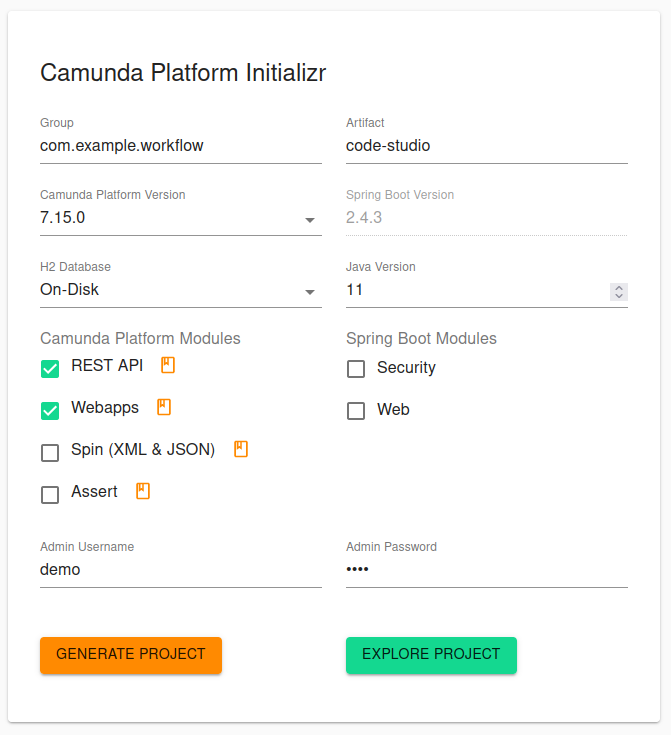
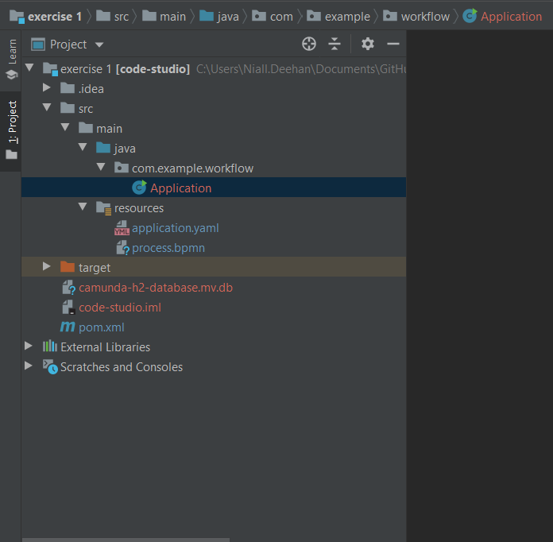
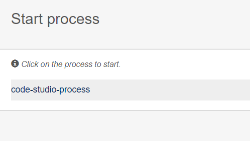
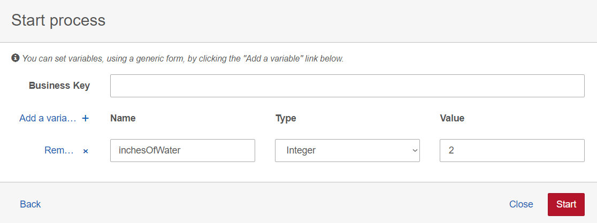
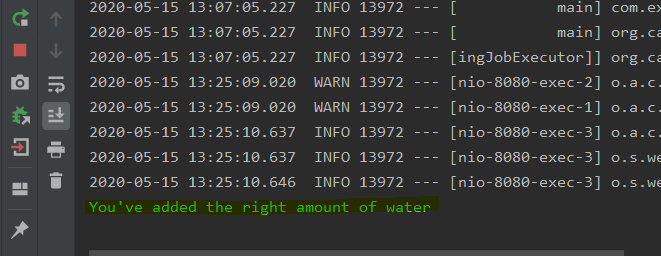
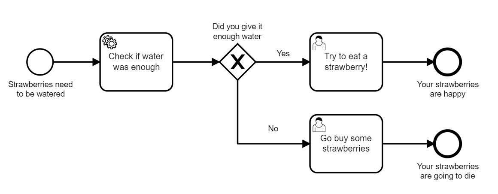
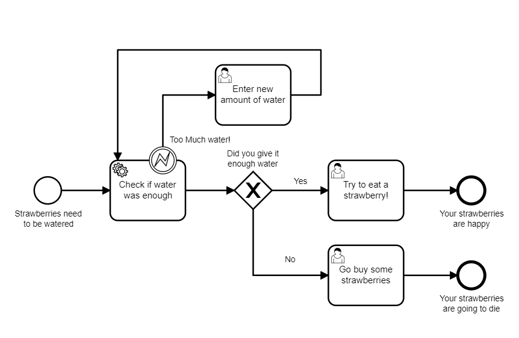
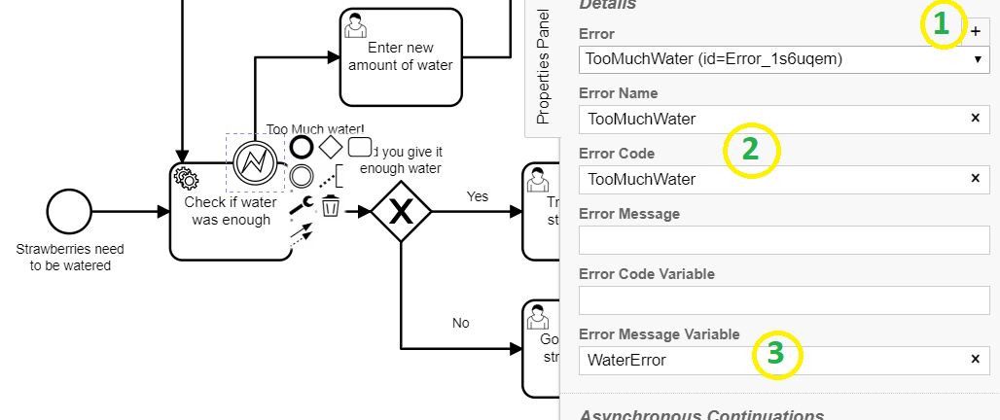

# Camunda Code Studio
Welcome to Camunda's Code studio. These exercises has been designed for an online course. But you can follow the exercises here without attending the online event - just imagine that you hear Niall talking to you. The readme contains the detailed instruction on how to complete the exercises.  In the other folders you find the model solutions as well as the full code solutions. The presentation from the workshop is provided as well.


To make that an even better learning experience Pull request are very welcome!


## Exercise 1: Set up a Camunda Springboot appliaction
:trophy: Goal of exercise number 1 is to create a running Camunda instance with Springboot.


Luckily we have the [Camunda BPM Intitializer](https://start.camunda.com/), which will create a plain Camunda Springboot project for us.



If you want to create the project manually and understand what the Camunda BPM Intitializer does, this [tutorial](https://docs.camunda.org/get-started/spring-boot/) guides you through it.

By generating your project you will download a zip file that contains a pom file with the needed dependencies as well as a simple application class in order to start Camunda as a spring boot application. Extract the file and import the project to an IDE of your choice (e.g.: in Eclipse: import -> existing maven project -> select unzipped folder or simply opening the pom.xml file with intellij)




Navigate to scr/main/java/com.example.workshop/Application.java. right click on the class and run it on your server. Springboot will start up Camunda. You should see this in the console.


To ensure that the webapps are working visit http://localhost:8080 and login with the credentials you have create in the Camunda BPM Intializer. The default is:

```
Usrename: demo
Password: demo
```

**:tada: Congrats you have a Camunda running**


## Exercise 2: Add a Process model to your application
:trophy: The goal of this exercise is to create a process for our application.

For this exercise we need the Camunda Modeler. If you don't have it already download it [here](https://camunda.com/download/modeler/)


Next, in the project you've created ``scr/main/ressource`` you'll see a file called process.bpmn open that process in the Camunda Modeler. We're going to change this process into something a little more interesting. Specifically something that has been taking up a lot of my time recently. Strawberries.


:pencil2:
One import part of keeping strawberries is not killing them. I've found that killing strawberries can be done by either not enough water or too much water. So in this process i can see is the amount of water i give my strawberries going to kill it.


Model the process.
*Hint: [Here](/solution-bpmn-models) you find the modeling solutions for the exercises.*
Save your model.


In order to make it run within Camunda we need to add the technical details. That means we need to provide code for the Service task. Three are a number of ways of running client code, but in this case, because i'm using spring boot i'm going to call a Java Class Directly. Which means using implmentation type: ``Delegate Expression`` and adding an expession which will point a java class that i'll write shortly. In this case we'll call it ``#{waterChecker}``


After adding the implmentation type to the model it's time i go ahead and write the java class that i intend to use.
Below is the code itself.

```java
package com.example.workflow;

import org.camunda.bpm.engine.delegate.DelegateExecution;
import org.camunda.bpm.engine.delegate.JavaDelegate;

import javax.inject.Named;

@Named
public class WaterChecker implements JavaDelegate {

    @Override
    public void execute(DelegateExecution delegateExecution) throws Exception {
        String strawberryStatus = "";
        Integer inchesOfWater = (Integer) delegateExecution.getVariable("inchesOfWater");

        if(inchesOfWater == 2){
            strawberryStatus = "You've added the right amount of water";
            delegateExecution.setVariable("waterSuccess", true);
        }else{
            strawberryStatus = "it's not looking good for your strawberries";
            delegateExecution.setVariable("waterSuccess", false);
        }

        delegateExecution.setVariable("strawberryStatus", strawberryStatus);
        System.out.println(strawberryStatus);
    }

}
```


Once you've added the class to your project the engine will find it in runtime and exectue the code. Settting a bunch of variables.
``waterSuccess`` is a boolean which is ``true`` if you've added enough water and ``strawberryStatus`` is a String in which a user can read the restults of the water they've added in plane english.

Now it's time to see it in action.

Restart your springboot application and once again naviat to http://localhost:8080/ login as before and you'll be greated by the welcome page


Click on the link for Tasklist where you can start your process my clicking the link on the top right of the screen.

.

Once you've clicked start process you'll able to see a list of processes - in this case there should only be one to click on. ``code-studio-process``



Clicking on it will bring up the start form - this is where we need to enter the amonut of water that we're going to add to the strawberries. The variable name is ``inchesOfWater`` and this can be entered by clicking on ``Add a variable`` and entering

```
Name:   inchesOfWater
Type:   Integer
Value:  2
```

The screeshot beblow should indicate what you should see.



So now the moment of truth... click ``Start`` to see your process run!
The first way you can tell that it's successful is by checking the console in your IDE. It should print something as seen Here



So - with that output we know that we've started an instance, but after that the process (according to our model) should move to a User Task in which we should be eating some strawberries. So see this task a simple filter will be required and this can be done with the click of a button. On the right of the screen you'll see a ``Add a simple filter`` button.


After clicking it a filter will be created revealing the user task, at which point you can

1. Select the Task
1. Click ``Claim`` on the Task
1. Inpect the variables by clicking ``Load Variables`` claim-complete-task.png
1. Compete the Task.


**:tada: Congrats your first process in Camunda runs and you have completed one instance of it**


## Exercise 3: Use process data to route your process
:trophy: The goal of this exercise is to use the data from the Service task to route your process.


:pencil2: Obviously our processes is not quite right, if we badly water our strawberries they're going to die and we wont be able to eat any :cry:. So we'll use the data generated by our Java class to route our process so ensure we only eat strawberries if we've properly watered it. So I'm going to need to change my model to the following



*Hint: [Here](/solution-bpmn-models) you find the modeling solutions for the exercises.*

Now we need to implement the technical details for the new version of the model. This means adding expressions to the Sequence flows that are leaving the XOR Gateway.

Each sequence flow will be evaluating the same variable ``waterSuccess`` if it's true we want to try our strawberries if it's false we'll want to head out and buy more strawberries.

Selecting the ``Yes`` sequence flow well let you add an expression. That expression should be
```
#{waterSuccess}
```

while the sequence flow for ``No`` should read
```
#{!waterSuccess}
```


The expression language used is from Java the Unified Expression Language (UEL). If you want to find an overview and more information you can look [here](https://docs.oracle.com/javaee/5/tutorial/doc/bnahq.html).

Restrating your spring boot applicatoin will create a new veresion of the model and so by following the same procedure of starting the process instance as in the previous step, you should be able to see the ``Try to eat a strawberry!`` user task if you've entered 2 inches of water or ``Go buy some strawberries`` if you have any other number.


**:tada: Congrats now your process can be routed depending the data you get**

## Exercise 4: Adding BPMN events to you process
:trophy: Trigger and Catch a BPMN Error event which will ensure that we water our strawberries too much.

To do this we need to check the amount of water and decided if we should throw an error or not. The error will be then need to be caught by the model. So first things first. I'm going ot add an error event to my model as well as a user task.



The error event needs to  expect a specific Error Code. This can be added via the modeler.

1. After selecting the error event click the plus button to create the error object.
1. Then enter ``TooMuchWater`` as both the Error Name and Error Code.
1. Finally add ``WaterError`` as the Error Message Variable.




Now that the model is read to each an error with the code ``TooMuchWater`` i'm going to need to throw the Error event from my code. I can do this by going back to my ``WaterChecker.java`` class and making a small change to the code. If the water is more than 2 inches i want to throw an error.

```Java

if(inchesOfWater > 2){
    throw new BpmnError("TooMuchWater", "Add Less water or the Strawberries will die!");
}
else if(inchesOfWater == 2){
    strawberryStatus = "You've added the right amount of water";
    delegateExecution.setVariable("waterSuccess", true);
}else{
    strawberryStatus = "it's not looking good for your strawberries";
    delegateExecution.setVariable("waterSuccess", false);
}

```
After making this change, it's time to re-launch the application and once again start a new instance. this time the variable ``inchesOfWater`` should be ``3``. in this case once we start the instance we should be brought to the ``Enter new amount of water`` user task. Claim the task and then load the variables in order to see and changes the inches of water. You should also be able to see the erorr message that was added via the Java class.
Change the variable and complete the task to finish the excersise.

**:tada: Congrats you've triggered an error event!**
